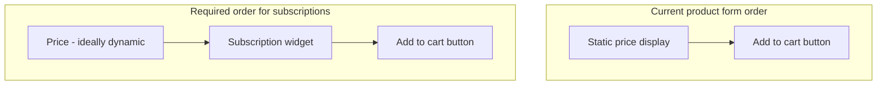

# Subscription App Compatibility Assessment

## Verdict

| Area | Status | Notes |
|------|--------|-------|
| **Product page** | **Not compatible today** | Custom AJAX add-to-cart ignores subscription fields |
| **Cart page** | **Mostly compatible** | Displays selling plan name; standard checkout flow works |

This applies to **Shopify Subscriptions (native selling plans)** and **third-party apps** (Recharge, Skio, Bold, Seal, Appstle, etc.) that inject a widget **before the Add to cart button** inside the product form.

---

## Product page — what works today

[`sections/product.liquid`](sections/product.liquid) already has good foundations:

- Standard Shopify product form: ``
- Correct hidden inputs: `name="id"` (variant) and `name="quantity"`
- `{{ content_for_header }}` in [`layout/theme.liquid`](layout/theme.liquid) allows apps to load global scripts
- Form wrapper is a logical place to insert a subscription widget **above** the CTA



---

## Product page — blockers (critical)

### 1. Custom AJAX add-to-cart strips subscription data

In [`sections/product.liquid`](sections/product.liquid) (lines 251–284), form submit is intercepted:

```javascript
event.preventDefault();
// ...
body: JSON.stringify({
  items: [{ id: Number(variantId), quantity: 1 }],
}),
```

**Problem:** Subscription apps inject hidden fields (most commonly `selling_plan`) and/or other inputs into the form. This code only sends variant ID + quantity, so:

- One-time purchase may still work
- **Subscription selections are silently dropped** — cart receives a regular one-time item

This breaks **Shopify native subscriptions** and most app-based widgets equally.

### 2. No mount point or app block support

- No placeholder `<div>` before the CTA for a subscription widget
- No `"type": "@app"` blocks in the product section schema — apps cannot be placed via Theme Editor on the product section
- No `` pattern used anywhere in the theme

### 3. No variant-change integration

- Variant is a hidden input set once at page load
- No JS to update variant ID when options change (single-variant product today, but subscription apps often hook variant change events to refresh plans/pricing)

### 4. Static price display

- Price is rendered server-side from `current_variant.price` only
- Subscription widgets typically update price dynamically when "Subscribe & save" is selected — your theme does not listen for those updates (cosmetic issue, not a functional blocker if form submit is fixed)

---

## Cart page — what works today

[`sections/cart.liquid`](sections/cart.liquid) is in good shape for subscriptions:

**Already implemented (lines 69–71):**
```liquid

  <p class="kaza-cart__item-plan">{{ item.selling_plan_allocation.selling_plan.name | escape }}</p>

```

**Also compatible:**
- Uses `item.final_line_price` / `item.original_line_price` — respects subscription discounts
- Standard cart form: `action="{{ routes.cart_url }}"` with `updates[]` and `name="checkout"`
- Checkout button posts to Shopify checkout — subscriptions continue through Shopify's checkout/subscription contract flow
- Styled plan label exists in [`assets/kaza-sections.css`](assets/kaza-sections.css) (`.kaza-cart__item-plan`)

---

## Cart page — minor gaps (non-blocking)

These are **nice-to-have**, not required for basic compatibility:

- No `"type": "@app"` blocks on cart section (some apps add cart upsells or subscription management widgets)
- No in-cart selling plan **edit** UI (most apps handle changes at checkout or customer account)
- Quantity +/- allows changing subscription qty — Shopify/apps may enforce rules at checkout (usually fine)
- Cart uses form POST (not `/cart/change.js`) — works, but full page reload on update

### Continue shopping should go to the product page

Today in [`sections/cart.liquid`](sections/cart.liquid), both navigation links fall back to the all-products collection:

- **Empty cart button** (line 38): `section.settings.empty_button_url | default: routes.all_products_collection_url`
- **Continue shopping link** (line 151): `section.settings.continue_shopping_url | default: routes.all_products_collection_url`

For a single-product store (KAZA serum), these should default to the **product page** so shoppers return to buy/subscribe rather than a generic collection.

**Recommended implementation:**

1. Add a `product` picker setting to the cart section schema (e.g. `continue_shopping_product`) so the merchant can select the main product in Theme Editor.
2. Compute a fallback URL in Liquid:
   ```liquid
   assign continue_url = section.settings.continue_shopping_url
   if continue_url == blank and section.settings.continue_shopping_product != blank
     assign continue_url = section.settings.continue_shopping_product.url
   endif
   if continue_url == blank
     assign continue_url = routes.all_products_collection_url
   endif
   ```
3. Use `continue_url` for **both** the empty-cart button and the summary **Continue shopping** link.
4. Set the default product in [`templates/cart.json`](templates/cart.json) once the product handle is known (or via Theme Editor after deploy).

This keeps URLs editable in Theme Editor while ensuring the out-of-the-box default sends users back to the product page.

---

## Compatibility by app type

### Shopify Subscriptions (native / selling plans)
- **Product:** Blocked until `selling_plan` is passed on add-to-cart
- **Cart:** Ready once items are added correctly

### Third-party apps (Recharge, Skio, Bold, Seal, etc.)
- **Product:** Blocked by AJAX interceptor; also needs widget mount point + usually `@app` block or app embed in Theme Editor
- **Cart:** Generally ready; some apps add extra cart widgets (optional `@app` block helps)

Most apps expect either:
1. **Native form submit** (no `preventDefault`), or
2. **AJAX that serializes the entire form** including all hidden/app fields

Your theme does neither today.

---

## Recommended prep work (when you add subscriptions)

### Priority 1 — Fix add-to-cart (required)

Update [`sections/product.liquid`](sections/product.liquid) JS to one of:

**Option A (simplest, most compatible):** Remove custom AJAX; let the product form submit normally to `/cart/add` (redirect to cart).

**Option B (keep AJAX UX):** Build cart payload from full form data:
```javascript
const formData = new FormData(form);
const sellingPlan = formData.get('selling_plan');
const item = { id: Number(formData.get('id')), quantity: Number(formData.get('quantity') || 1) };
if (sellingPlan) item.selling_plan = Number(sellingPlan);
// POST { items: [item] } to /cart/add.js
```

Option B preserves your current redirect-to-cart behavior while supporting subscriptions.

### Priority 2 — Add subscription widget slot (required for layout)

Insert **before** the CTA button inside the form (after price):

```liquid
<div class="kaza-product__subscription">
   App blocks or manual widget mount 
  
</div>
```

Add to product section schema:
```json
"blocks": [
  { "type": "@app" },
  { "type": "benefit", ... }
]
```

Add minimal CSS hook: `.kaza-product__subscription { width: 100%; margin-bottom: 1rem; }`

### Priority 3 — Cart navigation: Continue shopping → product page

Update [`sections/cart.liquid`](sections/cart.liquid) and [`templates/cart.json`](templates/cart.json):

- Add `product` picker setting for the default continue-shopping destination
- Point empty-cart and summary **Continue shopping** links at the selected product URL (see section above)
- Preserves optional URL override via existing `continue_shopping_url` / `empty_button_url` settings

### Priority 4 — Optional hardening

- Add `@app` block to [`sections/cart.liquid`](sections/cart.liquid) schema for cart-level app widgets
- Add variant-change listener if product gets multiple variants later
- Add `product | json` script tag if app docs require it (Recharge/Skio often do)
- Style subscription widget container to match KAZA pill/card patterns once app is chosen

---

## What you can do now (no code changes)

1. When installing a subscription app, enable its **Theme app extension / app embed** in Theme Editor
2. Confirm the app injects into the **product form** (not outside it)
3. Test: select subscription → add to cart → verify cart shows plan name (e.g. "Deliver every 30 days")

If plan name does **not** appear, the add-to-cart fix above is required.

---

## Bottom line

- **Cart:** Compatible for displaying and checking out subscription items once they are in the cart correctly.
- **Product page:** **Not compatible yet.** The subscription widget can be placed visually, but the current AJAX handler will ignore subscription selections until the form submission logic is updated and a widget mount point (`@app` block) is added before the Add to cart button.

No subscription app will work reliably on the product page without fixing the add-to-cart JavaScript first.
